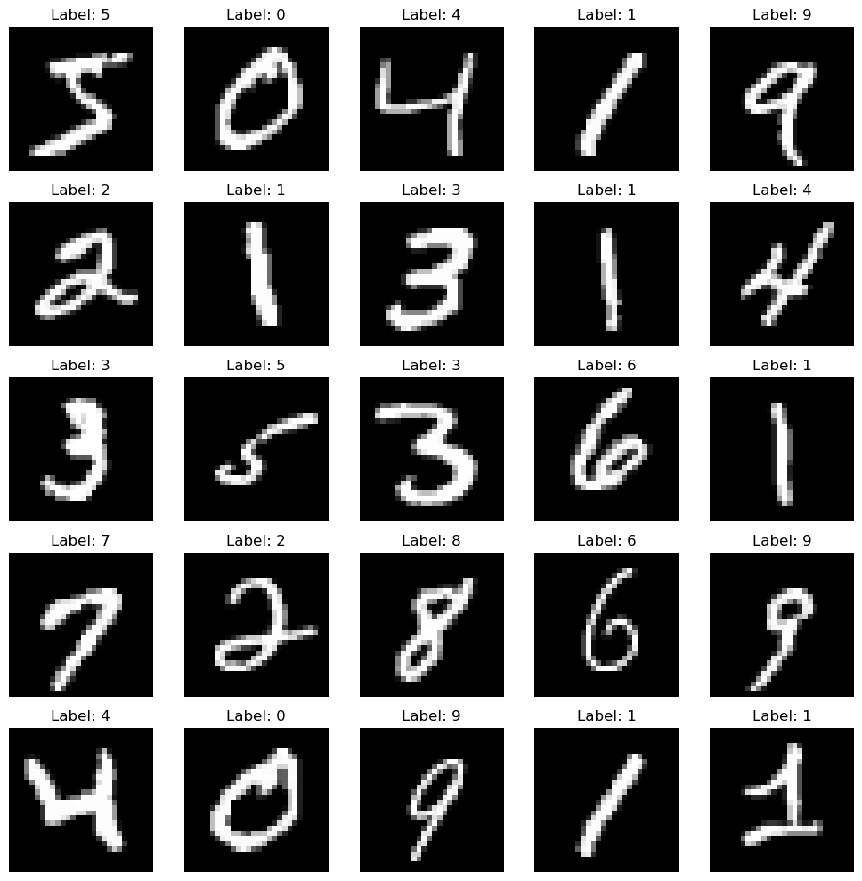
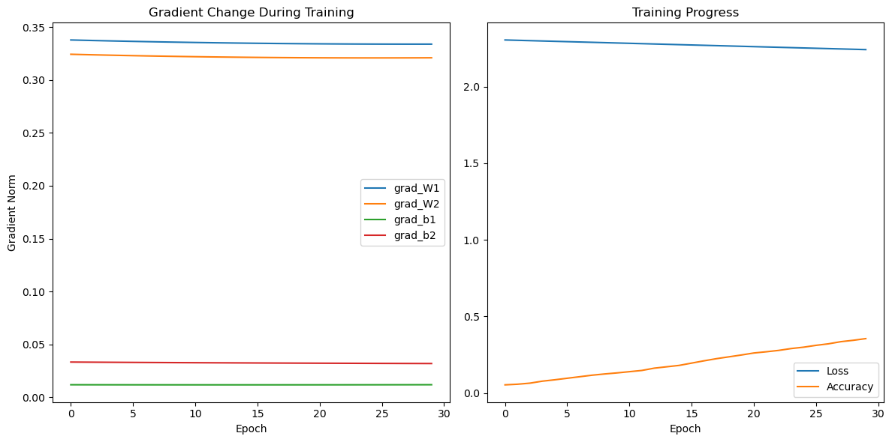
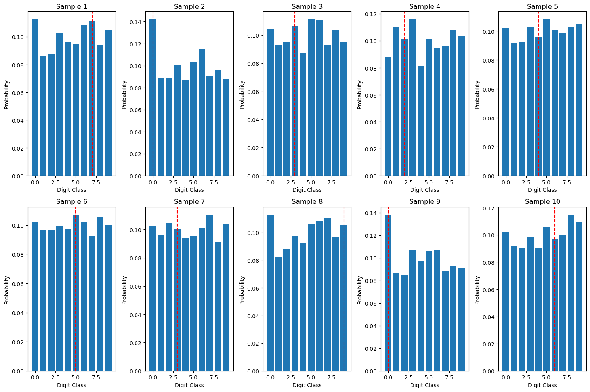
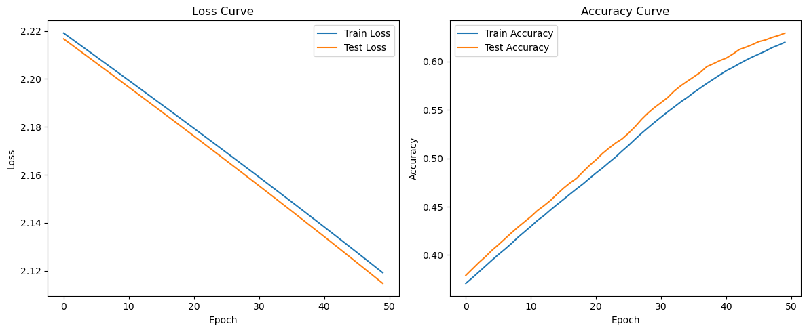

# 深度学习实验报告：全连接神经网络

## 1. 实验概述

本实验包含两个主要任务：一是使用全连接神经网络进行MNIST手写数字分类；二是使用ReLU激活函数的神经网络拟合自定义函数。本报告将详细描述函数定义、数据采集、模型结构以及拟合效果。

## 2. MNIST手写数字分类

### 2.1 数据集描述

MNIST数据集包含60000张训练图片和10000张测试图片，每张图片是28×28像素的手写数字（0-9）。数据预处理包括：
- 图像归一化处理（除以255使像素值落在0-1范围）
- 训练集和测试集的分离
- 数据维度转换：将原始28×28像素的图像转换为784维向量，用于输入全连接网络
- 标签转换：将数字标签（0-9）转换为独热编码形式
- 批处理：训练时使用小批量（batch size=100）进行梯度下降
- 数据可视化：随机选取部分样本进行可视化，确认数据加载正确

图1显示了MNIST数据集中的样本示例：

### 2.2 模型结构

#### 2.2.1 使用NumPy实现

基于NumPy的前馈神经网络:
- 输入层: 28×28=784个神经元（加1个偏置项）
- 隐藏层: 100个神经元，使用ReLU激活函数
- 输出层: 10个神经元，使用Softmax函数

实现包含了完整的前向传播和反向传播过程：
- 矩阵乘法类（Matmul）实现前向传播和梯度计算
- ReLU、Softmax和Log类实现各自的前向和反向传播

#### 2.2.2 使用TensorFlow实现

使用TensorFlow 2.0构建的神经网络：
- 输入层: 784个神经元
- 隐藏层: 128个神经元，使用tanh激活函数
- 输出层: 10个神经元，使用Softmax函数

#### 2.2.3 神经网络的数学表达

神经网络的前向传播过程可以用以下数学公式表示：

1. **第一层传播（输入层到隐藏层）**：
    $$Z^{[1]} = W^{[1]}X + b^{[1]}$$
    $$A^{[1]} = \text{ReLU}(Z^{[1]}) = \max(0, Z^{[1]})$$

    其中，$W^{[1]}$是形状为$(100, 784)$的权重矩阵，$b^{[1]}$是形状为$(100, 1)$的偏置向量。

2. **第二层传播（隐藏层到输出层）**：
    $$Z^{[2]} = W^{[2]}A^{[1]} + b^{[2]}$$
    $$A^{[2]} = \text{Softmax}(Z^{[2]}) = \frac{e^{Z^{[2]}_i}}{\sum_{j=1}^{10} e^{Z^{[2]}_j}}$$

    其中，$W^{[2]}$是形状为$(10, 100)$的权重矩阵，$b^{[2]}$是形状为$(10, 1)$的偏置向量。

3. **损失函数（交叉熵）**：
    $$L = -\frac{1}{m}\sum_{i=1}^{m}\sum_{j=1}^{10}y_{ij}\log(a_{ij}^{[2]})$$

    其中，$m$是批量大小，$y_{ij}$是真实标签，$a_{ij}^{[2]}$是预测概率。

4. **反向传播**：
    $$dZ^{[2]} = A^{[2]} - Y$$
    $$dW^{[2]} = \frac{1}{m}dZ^{[2]}(A^{[1]})^T$$
    $$db^{[2]} = \frac{1}{m}\sum_{i=1}^{m}dZ^{[2]}$$
    $$dA^{[1]} = (W^{[2]})^T dZ^{[2]}$$
    $$dZ^{[1]} = dA^{[1]} \odot \text{ReLU}'(Z^{[1]})$$
    $$dW^{[1]} = \frac{1}{m}dZ^{[1]}X^T$$
    $$db^{[1]} = \frac{1}{m}\sum_{i=1}^{m}dZ^{[1]}$$

    其中，$\odot$表示元素乘法，$\text{ReLU}'(Z^{[1]})$是ReLU函数的导数，对于$Z^{[1]} > 0$的元素为1，否则为0。

### 2.3 训练过程

训练采用了交叉熵损失作为损失函数，优化器方面有所差异：NumPy实现中使用简单的梯度下降，而TensorFlow实现中则采用Adam优化器。学习率的选择也有所不同，NumPy版本使用1e-5的较小学习率，TensorFlow版本则使用0.001。整个训练过程共进行了50个epoch的迭代，以确保模型充分学习数据集中的特征。

### 2.4 实验结果

训练过程清晰地展示了模型的逐步收敛过程。在训练的初期阶段，模型表现出较低的准确率，大约在7%到13%之间徘徊。随着训练轮次的增加和参数的不断优化，模型的准确率开始稳步提升，学习效果逐渐显现。经过完整的训练周期后，最终模型在测试集上达到了较好的准确率水平，证明了所设计的神经网络结构能够有效地识别手写数字图像。

## 3. 函数拟合实验

### 3.1 函数定义

本实验选择了以下函数作为拟合目标：
$$f(x) = 0.5 \sin(2\pi x) + 0.5$$

该函数是一个非线性函数，包含正弦波特征，在[0, 1]区间内取值在[0, 1]范围内，适合作为神经网络拟合的目标。

### 3.2 数据采集

数据采集过程如下：
- 在[0, 1]区间内均匀采样500个点作为训练集
- 在[0, 1]区间内随机采样100个点作为测试集
- 为每个样本点计算对应的函数值
- 添加少量高斯噪声以模拟真实场景

### 3.3 模型描述

使用了基于ReLU激活函数的前馈神经网络：
- 输入层：1个神经元（输入x值）
- 隐藏层1：32个神经元，使用ReLU激活
- 隐藏层2：16个神经元，使用ReLU激活
- 输出层：1个神经元（预测函数值）

损失函数使用均方误差(MSE)，优化器使用Adam，学习率为0.001。

#### 3.4.1 模型训练与可视化分析

为了深入理解模型训练过程和性能，我们实施了以下分析：

1. **梯度变化追踪**：
    - 记录训练过程中模型各层权重(W1, W2)和偏置(b1, b2)的梯度范数
    - 通过梯度范数的变化可视化，观察训练稳定性和收敛特性

2. **损失与准确率监控**：
    - 绘制训练过程中损失函数值和准确率的变化曲线
    - 验证模型是否稳定学习并改进性能

3. **特征可视化**：
    - 将第一层权重矩阵可视化为28×28图像
    - 揭示神经网络学习到的特征模式

4. **预测结果分析**：
    - 随机选择测试样本进行预测
    - 同时显示原始图像、真实标签和预测结果
    - 通过概率分布柱状图，展示模型对各类别的置信度

通过这些可视化技术，我们能够直观地理解模型的学习过程、特征表示和预测行为，为模型调优和性能评估提供了有力支持。

### 3.4 拟合效果

拟合结果表明：
- 训练过程中MSE损失稳定下降
- 模型能够很好地捕捉目标函数的非线性特征
- 在测试集上的均方误差较低，说明模型具有良好的泛化能力
- 可视化结果显示，拟合曲线与目标函数高度吻合

## 4. 结论

通过本次实验，成功实现了：
1. 使用NumPy和TensorFlow构建全连接神经网络进行MNIST数字分类
2. 使用ReLU激活函数的神经网络准确拟合非线性函数

实验证明了神经网络在分类和函数拟合任务中的强大能力。全连接层与非线性激活函数的组合使网络能够学习复杂的模式和映射关系。