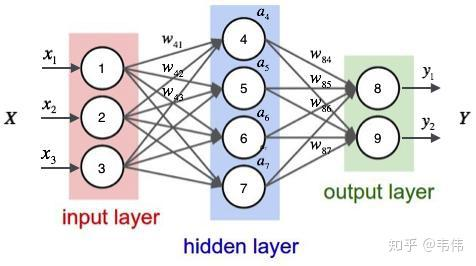
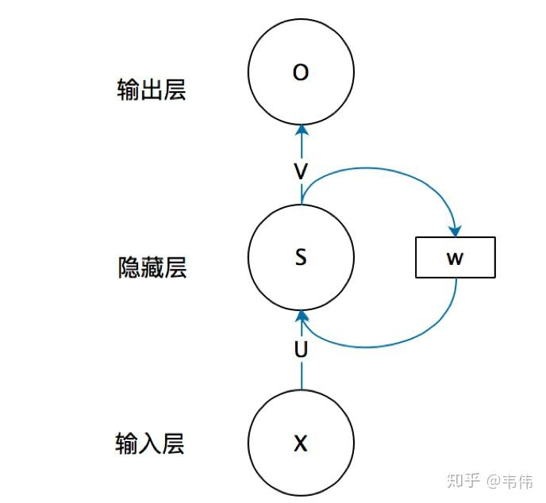
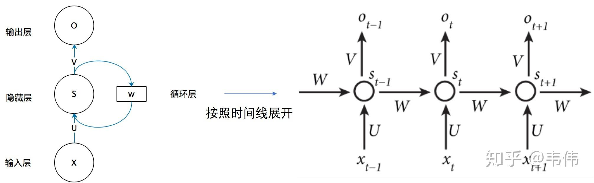
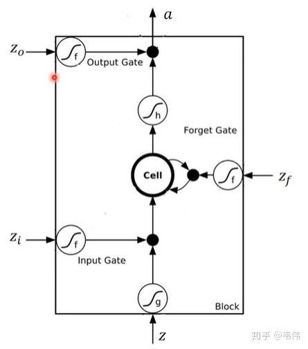
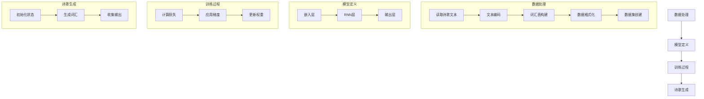
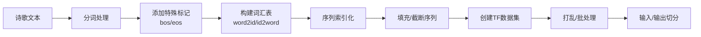
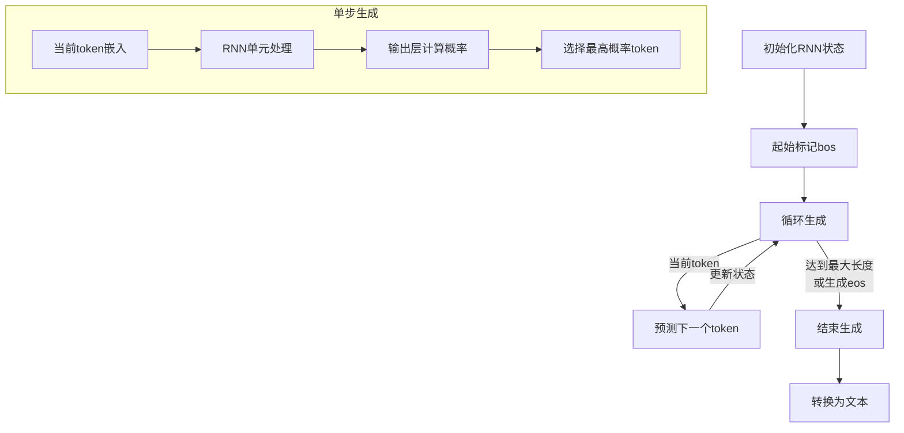

# 循环神经网络
RNN对具有序列特性的数据非常有效，它能挖掘数据中的时序信息以及语义信息，利用了RNN的这种能力，使深度学习模型在解决语音识别、语言模型、机器翻译以及时序分析等NLP领域的问题时有所突破。

我们需要重点来了解一下RNN的特点这句话，什么是序列特性呢？我个人理解，就是符合时间顺序，逻辑顺序，或者其他顺序就叫序列特性，举几个例子：

拿人类的某句话来说，也就是人类的自然语言，是不是符合某个逻辑或规则的字词拼凑排列起来的，这就是符合序列特性。
语音，我们发出的声音，每一帧每一帧的衔接起来，才凑成了我们听到的话，这也具有序列特性、
股票，随着时间的推移，会产生具有顺序的一系列数字，这些数字也是具有序列特性。

# 循环神经网络解决的问题
一个在NLP很常见的问题，命名实体识别，举个例子，现在有两句话：

第一句话：I like eating apple！（我喜欢吃苹果！）

第二句话：The Apple is a great company！（苹果真是一家很棒的公司！）

现在的任务是要给apple打Label，我们都知道第一个apple是一种水果，第二个apple是苹果公司，假设我们现在有大量的已经标记好的数据以供训练模型，当我们使用全连接的神经网络时，我们做法是把apple这个单词的特征向量输入到我们的模型中（如下图），在输出结果时，让我们的label里，正确的label概率最大，来训练模型，但我们的语料库中，有的apple的label是水果，有的label是公司，这将导致，模型在训练的过程中，预测的准确程度，取决于训练集中哪个label多一些，这样的模型对于我们来说完全没有作用。问题就出在了我们没有结合上下文去训练模型，而是单独的在训练apple这个单词的label，这也是全连接神经网络模型所不能做到的，于是就有了我们的循环神经网络。

与全连接神经网络对比，不用管W，只看X,U,S,V,O，这幅图就变成全连接神经网络

对整个结构展开

举个例子，有一句话是，I love you，那么在利用RNN做一些事情时，比如命名实体识别，上图中的$X_{t-1}$代表的就是I这个单词的向量，$X_t$代表的是love这个单词的向量，$X_{t+1}$代表的是you这个单词的向量，以此类推，我们注意到，上图展开后，W一直没有变，W其实是每个时间点之间的权重矩阵，我们注意到，RNN之所以可以解决序列问题，是因为它可以记住每一时刻的信息，每一时刻的隐藏层不仅由该时刻的输入层决定，还由上一时刻的隐藏层决定，公式如下，其中$Q_t$代表t时刻的输出,$S_t$代表t时刻的隐藏层的值：

$$S_t = f(U \cdot X_t + W \cdot S_{t-1} + b_s)$$
$$Q_t = g(V \cdot S_t + b_q)$$

其中：
- $S_t$是t时刻的隐藏状态
- $X_t$是t时刻的输入
- $U$是输入到隐藏层的权重矩阵
- $W$是隐藏层到隐藏层的权重矩阵（循环连接）
- $V$是隐藏层到输出层的权重矩阵
- $b_s$和$b_q$是偏置项
- $f$和$g$是激活函数，通常$f$使用tanh或ReLU，$g$根据任务可能是softmax（分类问题）或线性函数

从公式中可以看出，RNN的核心特点是将前一时刻的隐藏状态$S_{t-1}$作为当前时刻计算的一部分。这种循环连接使网络能够"记忆"之前看到的信息，从而在处理序列数据（如自然语言）时能够考虑上下文信息。这对命名实体识别等任务至关重要，因为同一个词（如"apple"）的含义往往取决于它所处的上下文环境。

# LSTM
## 为什么LSTM比普通RNN效果好？
这里就牵扯到梯度消失和爆炸的问题了，我简单说两句，上面那个最基础版本的RNN，我们可以看到，每一时刻的隐藏状态都不仅由该时刻的输入决定，还取决于上一时刻的隐藏层的值，如果一个句子很长，到句子末尾时，它将记不住这个句子的开头的内容详细内容。LSTM通过它的“门控装置”有效的缓解了这个问题，这也就是为什么我们现在都在使用LSTM而非普通RNN。
LSTM是RNN的一种变体，更高级的RNN，那么它的本质还是一样的，还记得RNN的特点吗，可以有效的处理序列数据，当然LSTM也可以，还记得RNN是如何处理有效数据的吗，是不是每个时刻都会把隐藏层的值存下来，到下一时刻的时候再拿出来用，这样就保证了，每一时刻含有上一时刻的信息，如图，我们把存每一时刻信息的地方叫做Memory Cell，中文就是记忆细胞，可以这么理解。

RNN什么信息它都存下来，因为它没有挑选的能力，而LSTM不一样，它会选择性的存储信息，因为它能力强，它有门控装置，它可以尽情的选择。如下图，普通RNN只有中间的Memory Cell用来存所有的信息，而从下图我们可以看到，LSTM多了三个Gate，也就是三个门，什么意思呢？在现实生活中，门就是用来控制进出的，门关上了，你就进不去房子了，门打开你就能进去，同理，这里的门是用来控制每一时刻信息记忆与遗忘的。
[!LSTM](LSTM.png)
* Input Gate：输入门，在每一时刻从输入层输入的信息会首先经过输入门，输入门的开关会决定这一时刻是否会有信息输入到Memory Cell。
* Output Gate：输出门，每一时刻是否有信息从Memory Cell输出取决于这一道门。
* Forget Gate：遗忘门，每一时刻Memory Cell里的值都会经历一个是否被遗忘的过程，就是由该门控制的，如果打卡，那么将会把Memory Cell里的值清除，也就是遗忘掉。

## LSTM的数学公式详解

图中最中间的地方，Cell，我们上面也讲到了memory cell，也就是一个记忆存储的地方，这里就类似于普通RNN的$S_t$，都是用来存储信息的，这里面的信息都会保存到下一时刻。在标准术语中，我们通常将这个隐藏状态表示为$h_t$，表示t时刻的隐藏状态。

LSTM的核心是细胞状态（cell state）$C_t$和隐藏状态（hidden state）$h_t$。LSTM通过三个门来控制信息流：

### LSTM的数学表达式：

**遗忘门**：
$$f_t = \sigma(W_f \cdot [h_{t-1}, x_t] + b_f)$$

**输入门**：
$$i_t = \sigma(W_i \cdot [h_{t-1}, x_t] + b_i)$$

**候选细胞状态**：
$$\tilde{C}_t = \tanh(W_C \cdot [h_{t-1}, x_t] + b_C)$$

**细胞状态更新**：
$$C_t = f_t \odot C_{t-1} + i_t \odot \tilde{C}_t$$

**输出门**：
$$o_t = \sigma(W_o \cdot [h_{t-1}, x_t] + b_o)$$

**隐藏状态更新**：
$$h_t = o_t \odot \tanh(C_t)$$

其中：
- $x_t$是当前时间步的输入
- $h_{t-1}$是前一时间步的隐藏状态
- $C_{t-1}$是前一时间步的细胞状态
- $W_f$, $W_i$, $W_C$, $W_o$是权重矩阵
- $b_f$, $b_i$, $b_C$, $b_o$是偏置项
- $\sigma$是sigmoid激活函数
- $\odot$表示Hadamard积（元素级乘法）

### 各个门的作用解析：

1. **遗忘门**($f_t$)：控制上一时刻的细胞状态有多少保留到当前时刻。当$f_t$接近1时，几乎完全保留上一状态；接近0时，几乎完全丢弃。

2. **输入门**($i_t$)：控制当前输入的信息有多少被加入到细胞状态中。它与候选细胞状态$\tilde{C}_t$相乘，决定要添加的新信息量。

3. **细胞状态更新**：先通过遗忘门选择性地忘记部分旧信息，再通过输入门添加新信息。

4. **输出门**($o_t$)：控制当前细胞状态有多少输出给隐藏状态$h_t$，隐藏状态既作为当前时间步的输出，也传递给下一时间步。

这种设计使LSTM能够长期记住重要信息，同时有选择地遗忘不重要的信息，有效缓解了普通RNN中的梯度消失问题，使模型能处理更长的序列依赖关系。1表示该门完全打开，0表示该门完全关闭。

# GRU
GRU (Gated Recurrent Unit) 是LSTM的一种变体，由Cho等人在2014年提出。它保留了LSTM处理长期依赖问题的能力，但结构更加简化，参数更少，训练速度更快。

## GRU的基本结构

与LSTM的三个门不同，GRU只有两个门：
- **更新门(Update Gate)** $z_t$：控制前一时刻的隐藏状态有多少被保留，以及当前新信息有多少被添加
- **重置门(Reset Gate)** $r_t$：控制前一隐藏状态对当前候选隐藏状态的影响程度

## GRU的数学表达式

**更新门**：
$$z_t = \sigma(W_z \cdot [h_{t-1}, x_t] + b_z)$$

**重置门**：
$$r_t = \sigma(W_r \cdot [h_{t-1}, x_t] + b_r)$$

**候选隐藏状态**：
$$\tilde{h}_t = \tanh(W \cdot [r_t \odot h_{t-1}, x_t] + b)$$

**最终隐藏状态**：
$$h_t = (1 - z_t) \odot h_{t-1} + z_t \odot \tilde{h}_t$$

其中：
- $x_t$ 是当前时间步的输入
- $h_{t-1}$ 是前一时间步的隐藏状态
- $W_z$, $W_r$, $W$ 是权重矩阵
- $b_z$, $b_r$, $b$ 是偏置项
- $\sigma$ 是sigmoid激活函数
- $\odot$ 表示Hadamard积（元素级乘法）

## GRU相比LSTM的优势

1. **计算效率更高**：
    - GRU参数数量更少（只有两个门控单元而非三个）
    - 没有单独的细胞状态，减少了计算复杂度
    - 在相同的计算资源下，可以训练更大的模型或处理更多数据

2. **解决梯度问题的效果**：
    - 更新门直接控制前一时刻状态的保留程度，信息路径更直接
    - 梯度流通道更少，减轻了梯度消失的风险
    - 在处理中等长度序列时尤其有效

3. **较少的过拟合风险**：
    - 参数更少，降低了模型过拟合的风险
    - 对小数据集友好，泛化能力往往更好

4. **训练速度优势**：
    - 在大规模数据集上，训练速度比LSTM快约20-30%
    - 迭代更快，有利于模型快速调优和验证

5. **易于实现和调试**：
    - 结构更简单，实现代码更简洁
    - 更少的超参数需要调整
    - 模型行为更容易理解和预测

## GRU的实际应用

GRU在以下场景中表现尤为出色：
- 中短文本分类任务（如情感分析）
- 资源受限的环境（如移动设备上的自然语言处理）
- 实时系统（如语音识别）
- 需要快速训练和迭代的研究或应用场景

## GRU vs LSTM：如何选择？

- 数据集较小或计算资源有限时，优先考虑GRU
- 需要捕获非常长期依赖关系时，LSTM可能更有优势
- 对时间效率要求高的场景，GRU是更好的选择
- 实际应用中，建议两者都尝试，根据验证集性能决定

GRU通过简化结构在保持性能的同时提高了效率，是深度学习中处理序列数据的重要工具。它的设计理念也启发了更多高效RNN变体的发展，推动了自然语言处理等领域的进步。

tensorflow版本
数据处理
读取数据：process_dataset 函数负责读取诗歌文本文件（poems.txt），并对每一行进行处理。每行文本被分割成两部分：标签（: 前的内容）和内容（: 后的内容）。

文本编码：将文本内容转换为一系列的词汇索引。首先，定义了特殊的开始（bos）和结束（eos）标记，并将它们添加到文本的开始和结束位置。

词汇表构建：统计所有文本中的词汇，并创建一个词汇表（word2id），将每个词汇映射到一个唯一的索引。

数据格式化：将文本序列转换为索引序列，并根据最大序列长度进行截断或填充。

数据集创建：poem_dataset 函数将处理后的数据转换为TensorFlow数据集（tf.data.Dataset），并进行打乱和批量处理。

模型定义
嵌入层：myRNNModel 类中的 embed_layer 将词汇索引转换为固定大小的嵌入向量。

RNN层：使用 SimpleRNNCell 作为循环单元，并堆叠成 RNN 层，以便处理序列数据。

输出层：一个全连接层（Dense），将RNN的输出转换为词汇空间的概率分布。

训练过程
损失函数：compute_loss 函数计算模型输出和真实标签之间的交叉熵损失，并通过序列长度进行加权平均。

优化器：使用Adam优化器来更新模型的权重。

训练循环：train_one_step 函数执行单步训练，计算损失并应用梯度更新。

训练循环：train 函数执行多个训练周期（epoch），在每个周期中遍历整个数据集。

文本生成
初始化状态：生成过程开始时，初始化RNN的状态。

生成词汇：从特殊的开始标记（bos）开始，迭代地生成下一个词汇，直到达到最大长度或生成结束标记（eos）。

收集输出：将生成的词汇索引转换回文本形式，并拼接成完整的诗歌。
## 模型流程图

## 数据处理流程

## 文本生成过程

